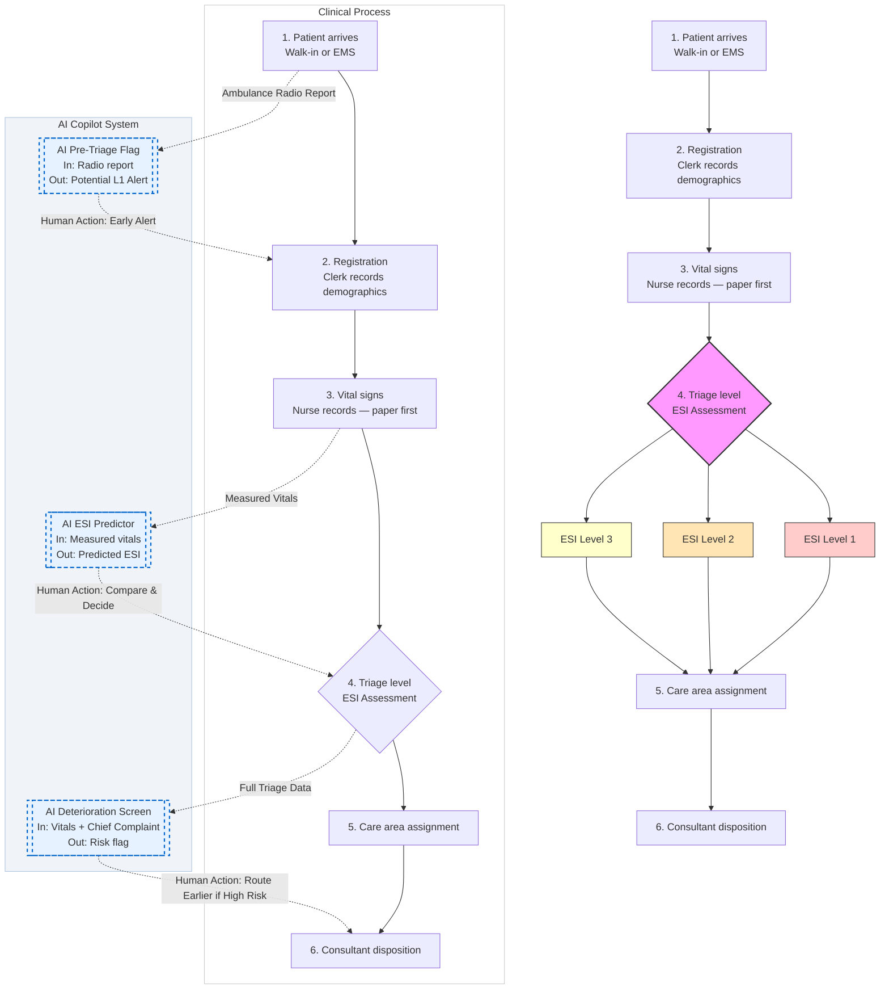

```mermaid
graph TD

    %% ── FLOW 1: ESI TRIAGE ──────────────────────────────────────────
    A["1. Patient arrives\nWalk-in or EMS"]
    B["2. Registration\nClerk records demographics"]
    C["3. Vital signs\nNurse records — paper first"]
    D{"4. Triage level\nESI Assessment"}
    E1[ESI Level 1]
    E2[ESI Level 2]
    E3[ESI Level 3]
    F1[5. Care area assignment]
    G1[6. Consultant disposition]

    A --> B
    B --> C
    C --> D
    D --> E1
    D --> E2
    D --> E3
    E1 --> F1
    E2 --> F1
    E3 --> F1
    F1 --> G1

    style D  fill:#f9f,stroke:#333,stroke-width:2px
    style E1 fill:#ffcccb,stroke:#333
    style E2 fill:#ffe5b4,stroke:#333
    style E3 fill:#ffffcc,stroke:#333

    %% ── FLOW 2: CLINICAL + AI LAYER ────────────────────────────────
    subgraph Clinical_Flow [Clinical Process]
        AA["1. Patient arrives\nWalk-in or EMS"]
        AB["2. Registration\nClerk records demographics"]
        AC["3. Vital signs\nNurse records — paper first"]
        AD{"4. Triage level\nESI Assessment"}
        AE[5. Care area assignment]
        AF[6. Consultant disposition]
    end

    subgraph AI_Layer [AI Copilot System]
        AI_EMS[["AI Pre-Triage Flag\nIn: Radio report\nOut: Potential L1 Alert"]]
        AI_Vitals[["AI ESI Predictor\nIn: Measured vitals\nOut: Predicted ESI"]]
        AI_Deteriorate[["AI Deterioration Screen\nIn: Vitals + Chief Complaint\nOut: Risk flag"]]
    end

    AA --> AB
    AB --> AC
    AC --> AD
    AD --> AE
    AE --> AF

    AA -.->|Ambulance Radio Report| AI_EMS
    AI_EMS -.->|Human Action: Early Alert| AB

    AC -.->|Measured Vitals| AI_Vitals
    AI_Vitals -.->|Human Action: Compare & Decide| AD

    AD -.->|Full Triage Data| AI_Deteriorate
    AI_Deteriorate -.->|Human Action: Route Earlier if High Risk| AF

    style AI_EMS        fill:#e6f2ff,stroke:#0066cc,stroke-width:2px,stroke-dasharray: 5 5
    style AI_Vitals     fill:#e6f2ff,stroke:#0066cc,stroke-width:2px,stroke-dasharray: 5 5
    style AI_Deteriorate fill:#e6f2ff,stroke:#0066cc,stroke-width:2px,stroke-dasharray: 5 5
    style AI_Layer      fill:#f0f4f8,stroke:#b0c4de,stroke-width:1px
    style Clinical_Flow fill:#ffffff,stroke:#cccccc,stroke-width:1px
```
