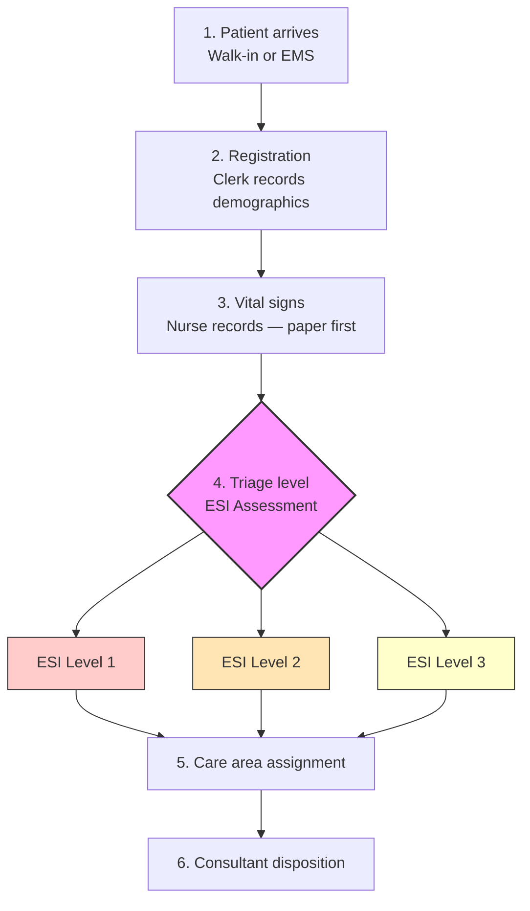

```mermaid
graph TD
    A["1. Patient arrives\nWalk-in or EMS"]
    B["2. Registration\nClerk records demographics"]
    C["3. Vital signs\nNurse records — paper first"]
    D{"4. Triage level\nESI Assessment"}
    E1[ESI Level 1]
    E2[ESI Level 2]
    E3[ESI Level 3]
    F[5. Care area assignment]
    G[6. Consultant disposition]

    A --> B
    B --> C
    C --> D

    D --> E1
    D --> E2
    D --> E3

    E1 --> F
    E2 --> F
    E3 --> F

    F --> G

    style D fill:#f9f,stroke:#333,stroke-width:2px
    style E1 fill:#ffcccb,stroke:#333
    style E2 fill:#ffe5b4,stroke:#333
    style E3 fill:#ffffcc,stroke:#333
```
